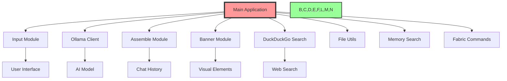

# 🌈 AI_Functions: Comprehensive Architecture Guide 🤖

Welcome to the magical world of AI_Functions! 🎉 This guide will take you on a journey through the architecture and components of our AI assistant builder. It's like having a LEGO set for AI - mix, match, and build your dream assistant! 🧱✨

## 🚀 Introduction and Key Features

AI_Functions is a modular and flexible framework for creating AI assistants. Here are some of its key features:

- 🎨 Colorful command-line interface
- 🧠 Enhanced memory management
- 🔍 Integrated DuckDuckGo search capabilities
- 🛠️ Modular design for easy customization
- 💬 Interactive CLI built with `prompt_toolkit`
- 🔐 Secure configuration options
- 🧪 Comprehensive testing suite
- 📜 Built-in chat history management

## 🏗️ System Architecture Overview

AI_Functions is designed with modularity and flexibility in mind. Here's a high-level view of how the components fit together:



## 🧱 Core Components

Let's dive deeper into each core component of AI_Functions:

### 1. 🎛️ Main Application (`main.py`)
The conductor of our AI orchestra, coordinating all the modules.

### 2. 📥 Input Module (`input.py`)
Handles all user inputs with style, supporting command history and auto-completion.

### 3. 🤖 Ollama Client (`ollama_client.py`)
Manages communication with the Ollama AI model, sending prompts and receiving responses.

### 4. 🧩 Assemble Module (`assemble.py`)
Maintains conversation history and assembles context for AI prompts.

### 5. 🎨 Banner Module (`banner.py`)
Creates beautiful visual elements for the CLI interface.

### 6. 🔍 DuckDuckGo Search (`ddg_search.py`)
Integrates web search capabilities, allowing the AI to access current information.

### 7. 📁 File Utils (`file_utils.py`)
Handles file operations, including reading and writing JSON files.

### 8. 🧠 Memory Search (`memory_search.py`)
Implements advanced memory search functionality using embeddings.

### 9. 🧵 Fabric Commands (`fabric_commands.py`)
Integrates Fabric patterns for enhanced AI interactions.

## 🔄 Data Flow

1. User input ➡️ Input Module
2. Input Module ➡️ Main Application
3. Main Application ➡️ Appropriate Module (based on command)
4. Module Processing ➡️ Main Application
5. Main Application ➡️ Ollama Client (if needed)
6. Ollama Client ➡️ Main Application
7. Main Application ➡️ User (via Banner Module)

## 🧪 Testing Architecture

The project now includes a comprehensive test suite located in `src/tests/`. Key test files include:

- `test_file_utils.py`: Tests for file operations
- `test_input.py`: Tests for user input handling
- `test_memory_search.py`: Tests for memory search functionality
- `test_ollama_client.py`: Tests for Ollama API interactions
- `test_save_history.py`: Tests for chat history management

Run all tests using:
```bash
python -m unittest discover src/tests
```

## 🛠️ Customization Points

- 🎭 **Personality**: Tweak `config.py` to adjust your AI's persona.
- 🧠 **AI Model**: Modify `ollama_client.py` to use different AI backends.
- 🌈 **Appearance**: Customize `banner.py` for a unique look.
- 🔍 **Search Engine**: Extend `ddg_search.py` to add more search providers.

## 🚀 Scaling Up

As your AI assistant grows, consider:

1. 📊 Database integration for long-term memory
2. 🌐 API endpoints for web/mobile interfaces
3. 🧠 Multiple AI models for specialized tasks
4. 🔒 Enhanced security features
5. 🔧 Performance optimizations for large-scale deployments

## 🎉 Conclusion

AI_Functions is designed to be both powerful and playful. Each module plays a crucial role, and together they create an AI assistant that's greater than the sum of its parts. This architecture allows for easy customization and extension, making it a versatile platform for building AI assistants.

Remember to keep your tests up-to-date as you add new features or modify existing ones. This will ensure the continued reliability and maintainability of your AI assistant.

Happy building! 🏗️✨
