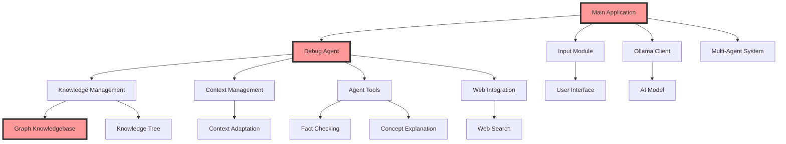

# 🏗️ Ollama_Agents: Comprehensive Architecture Guide 🤖

## 1. 🌐 Overview

Ollama_Agents is a sophisticated, modular framework for creating advanced AI assistants. It leverages the Ollama API and is designed with extensibility, debugging capabilities, and cognitive transparency in mind. The system's cornerstone is its unique JSON-based graph knowledgebase, providing a flexible and powerful way to represent and manage knowledge.

## 2. 🚀 Key Components

- 🕸️ Graph Knowledgebase: Core component for storing and managing relational knowledge
- 🧠 Debug Agent: Provides detailed visualization of the agent's cognitive processes
- 🌳 Knowledge Management: Handles knowledge acquisition, storage, and retrieval
- 🔍 Context Management: Manages conversation context and adapts it to user profiles
- 🛠️ Agent Tools: A suite of utilities for various AI tasks
- 🌐 Web Integration: Allows agents to perform web searches and fact-checking
- 💬 Multi-Agent System: Enables interaction with multiple AI personalities
- 🎨 Rich CLI: Provides an engaging and informative user interface

## 3. 🏗️ System Architecture

Ollama_Agents uses a modular architecture for flexibility and ease of extension:

## 4. 🧱 Core Components

### 4.1 Graph Knowledgebase (`src/modules/kb_graph.py`)
- Implements a JSON-based graph structure for knowledge representation
- Provides methods for adding, querying, and updating knowledge
- Supports complex relationships between concepts
- Enables efficient traversal and search of the knowledge graph

### 4.2 Debug Agent (`src/agents/debug_agent.py`)
- Provides detailed visualization of the agent's cognitive processes
- Handles user interactions and command processing
- Manages the overall flow of information and decision-making
- Integrates with the graph knowledgebase for knowledge retrieval and updates

### 4.3 Knowledge Management (`src/modules/knowledge_management.py`)
- Interfaces with the graph knowledgebase for knowledge operations
- Handles knowledge acquisition, validation, and integration
- Generates and manages the knowledge tree
- Provides functions for topic classification and summarization

### 4.4 Context Management (`src/modules/context_management.py`)
- Manages conversation context
- Adapts context based on user profiles
- Handles context prioritization and gap identification
- Integrates context with the graph knowledgebase

### 4.5 Agent Tools (`src/modules/agent_tools.py`)
- Provides utility functions for various AI tasks
- Includes tools for fact-checking, concept explanation, and response generation
- Interfaces with the graph knowledgebase for information retrieval and validation

### 4.6 Web Integration (`src/modules/ddg_search.py`)
- Enables web searches using DuckDuckGo
- Supports fact-checking and information gathering
- Integrates search results with the graph knowledgebase

### 4.7 Multi-Agent System (`src/agents/multi_agent.py`)
- Manages multiple AI personalities
- Allows switching between different agent personas
- Integrates with the graph knowledgebase for personality-specific knowledge

## 5. 🔄 Data Flow

1. User input (`input.py`) → Debug Agent (`debug_agent.py`)
2. Debug Agent coordinates processing through various modules
3. Knowledge retrieval and update (`kb_graph.py`, `knowledge_management.py`)
4. Context gathering and adaptation (`context_management.py`)
5. Web search and fact-checking if necessary (`ddg_search.py`, `agent_tools.py`)
6. Response generation (`agent_tools.py`)
7. Knowledge graph update based on interaction (`kb_graph.py`)
8. Output formatting and display (`debug_agent.py`)

## 6. 🧠 Advanced Features

### 6.1 Graph Knowledgebase
- JSON-based graph structure for flexible knowledge representation
- Supports complex, multi-dimensional relationships between concepts
- Enables efficient querying and updating of interconnected information
- Provides a clear, interpretable view of the AI's knowledge structure

### 6.2 Knowledge Tree
- Dynamic generation and visualization of knowledge structures
- Helps in organizing and connecting information within the graph knowledgebase
- Provides a hierarchical view of the AI's knowledge

### 6.3 Fact-Checking and Credibility Assessment
- Verifies information against web sources and the graph knowledgebase
- Assesses the credibility of sources and information
- Updates the graph knowledgebase with credibility scores

### 6.4 User Profiling
- Adapts responses based on user expertise level and interests
- Personalizes the interaction experience
- Stores user profiles within the graph knowledgebase for persistent adaptation

### 6.5 Interactive Follow-up
- Generates and handles follow-up questions
- Deepens the conversation and exploration of topics
- Uses the graph knowledgebase to generate relevant and insightful questions

## 7. 🔧 Extensibility

- New agents can be added to the `agents/` directory
- Additional modules can be integrated into the `modules/` directory
- The graph knowledgebase can be extended with new relationship types and properties
- The debug agent can be extended with new commands and visualization tools

## 8. 🔐 Configuration and Security

- Central configuration managed in `config.py`
- Environment variables for sensitive information
- Secure handling of user data and conversation history
- Access controls for the graph knowledgebase to ensure data integrity

## 9. 🧪 Testing and Quality Assurance

- Comprehensive test suite in `src/tests/`
- Covers core functionalities, modules, and edge cases
- Specific tests for graph knowledgebase operations
- Regular testing ensures reliability and performance

## 10. 🚀 Future Enhancements

- Implementation of more sophisticated NLP techniques integrated with the graph knowledgebase
- Enhanced multi-modal capabilities (image, audio processing) with knowledge graph integration
- Improved long-term learning capabilities using the graph structure
- Implementation of reasoning algorithms leveraging the graph knowledgebase
- Integration with external knowledge bases and ontologies
- Development of visualization tools for the graph knowledgebase

## 11. 📊 Performance Considerations

- Optimization of graph traversal algorithms for large-scale knowledge bases
- Caching mechanisms for frequently accessed knowledge
- Asynchronous updates to the graph knowledgebase to maintain responsiveness
- Scalability planning for growing knowledge bases

## 12. 🔄 Continuous Learning

- Mechanisms for the AI to autonomously update its graph knowledgebase
- Integration of user feedback to refine and correct knowledge
- Periodic review and pruning of outdated or low-confidence information in the graph

## 13. 🌐 Interoperability

- APIs for external systems to query and update the graph knowledgebase
- Export and import functionality for the knowledge graph
- Integration capabilities with other AI systems and knowledge repositories

## 14. 📈 Monitoring and Analytics

- Tools for visualizing the growth and evolution of the knowledge graph
- Analytics on knowledge utilization and gaps
- Performance metrics for response generation and knowledge retrieval

## 15. 🔒 Ethical Considerations

- Mechanisms to ensure fairness and reduce bias in the knowledge representation
- Transparency in knowledge sourcing and credibility assessment
- User privacy protections in knowledge storage and utilization

## 16. 🎓 Conclusion

The Ollama_Agents architecture, centered around its innovative JSON-based graph knowledgebase, represents a significant advancement in AI assistant design. By combining flexible knowledge representation, modular components, and advanced features like dynamic learning and multi-agent capabilities, it provides a robust foundation for creating sophisticated, context-aware, and continually evolving AI systems.

This architecture not only enhances the current capabilities of AI assistants but also paves the way for future innovations in artificial intelligence and knowledge management. As the system evolves, it will continue to push the boundaries of what's possible in AI-human interaction and knowledge representation.
