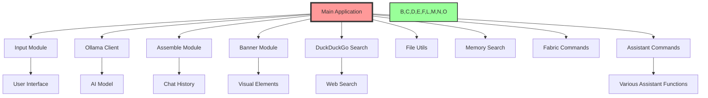

# 🏗️ Ollama_Agents: Comprehensive Architecture Guide 🤖

## 1. 🌐 Overview

Ollama_Agents is a modular and flexible framework for creating AI assistants. It leverages the Ollama API and is designed with extensibility in mind, allowing users to create and interact with multiple AI agents.

## 2. 🚀 Key Features

- 🎭 Multi-agent system: Interact with multiple AI personalities
- 🔀 Easy agent selection from the main menu
- 🎨 Colorful command-line interface
- 🧠 Enhanced memory management
- 🔍 Integrated DuckDuckGo search capabilities
- 🛠️ Modular design for easy customization
- 💬 Interactive CLI built with `prompt_toolkit`
- 🔐 Secure configuration options
- 🧪 Comprehensive testing suite
- 📜 Built-in chat history management
- 🔎 Memory search commands: `/ms` and `/msl`
- 🧵 Fabric pattern integration with `/fabric` command
- 🤖 Assistant command functionality

## 3. 🏗️ System Architecture

Ollama_Agents is designed with modularity and flexibility in mind. Here's a high-level view of the components:



## 4. 🧱 Core Components

### 4.1 Main Application (`src/main.py`)
- Entry point of the application
- Manages the overall flow and agent selection
- Initializes logging system

### 4.2 Agents (`src/agents/`)
- `multi_agent.py`: Implements multi-agent functionality
- `one_agent.py`: Implements single agent functionality
- `simple_agent.py`: Basic agent implementation

### 4.3 Modules (`src/modules/`)
- `assemble.py`: Handles prompt assembly and history management
- `banner.py`: Manages CLI visual elements
- `basic_commands.py`: Implements core slash commands
- `chunk_history.py`: Manages document chunk history
- `ddg_search.py`: Integrates DuckDuckGo search functionality
- `document_commands.py`: Handles document-related operations
- `fabric_commands.py`: Integrates Fabric pattern functionality
- `file_utils.py`: Provides file handling utilities
- `input.py`: Manages user input processing
- `memory_commands.py`: Implements memory-related operations
- `memory_search.py`: Handles memory search functionality
- `ollama_client.py`: Manages communication with Ollama API
- `save_history.py`: Handles saving and loading of chat history
- `slash_commands.py`: Implements slash command processing
- `logging_setup.py`: Configures and initializes the logging system

## 5. 🔄 Data Flow

1. User input (`input.py`) → Main application (`main.py`)
2. Command processing (`slash_commands.py`) or agent interaction
3. If agent interaction:
   a. Prompt assembly (`assemble.py`)
   b. API communication (`ollama_client.py`)
   c. Response processing and display
4. Logging of operations and errors (`logging_setup.py`)

## 6. 🧠 Memory Management

- Short-term memory: Managed in `save_history.py`
- Long-term memory: Implemented through document chunks and embeddings
- Memory search: Implemented in `memory_search.py`

## 7. 🔍 Search Functionality

- Memory search: `/ms` and `/msl` commands
- Web search: Integrated through `ddg_search.py`

## 8. 🎨 User Interface

- CLI interface with rich formatting (`banner.py`)
- Interactive input handling (`input.py`)
- Customizable prompt style

## 9. 🔧 Extensibility

- New agents can be added to the `agents/` directory
- Additional modules can be integrated into the `modules/` directory
- Fabric patterns can be added through the `/fabric` command
- Assistant commands can be extended in `slash_commands.py`

## 10. 🔐 Configuration

- Central configuration managed in `config.py`
- Environment variables for sensitive information

## 11. 🧪 Testing

- Comprehensive test suite in `src/tests/`
- Covers core functionalities and modules
- Run tests using: `python -m unittest discover src/tests`

## 12. 🤖 Assistant Command Functionality

The `/assistant` command provides a flexible way to add various helper functions to the Ollama_Agents system. This functionality is primarily implemented in the `slash_commands.py` file.

### 12.1 Structure of Assistant Commands

Assistant commands are handled within the `assistant_command` function in `slash_commands.py`. The function uses a series of conditional statements to determine which specific assistant action to perform based on the user's input.

### 12.2 Adding New Assistant Commands

To add a new assistant command:

1. Open `src/modules/slash_commands.py`.
2. Locate the `assistant_command` function.
3. Add a new `elif` condition for your command. For example:

   ```python
   elif 'your_new_command' in command:
       # Implement your command logic here
       console.print("Your new command executed successfully", style="bold green")
   ```

4. If your command requires external libraries or complex logic, consider creating a separate function or even a new module, and call it from within the `assistant_command` function.

### 12.3 Testing Assistant Commands

To test new assistant commands:

1. Open `src/tests/test_assistant_commands.py`.
2. Add a new test method for your command. For example:

   ```python
   @patch('your_mocked_dependency')
   def test_your_new_command(self, mock_dependency):
       mock_dependency.return_value = "Expected result"
       result = assistant_command('/assistant your_new_command')
       self.assertEqual(result, 'CONTINUE')
       # Add more assertions as needed
   ```

3. Run the tests using:
   ```
   python -m unittest src/tests/test_assistant_commands.py
   ```

### 12.4 Best Practices for Assistant Commands

- Keep each command focused on a single task.
- Use clear and descriptive names for your commands.
- Implement proper error handling and provide user-friendly error messages.
- Update the help documentation when adding new commands.
- Consider the security implications of each command, especially if it interacts with the file system or external services.

## 13. 🛠️ Customization Points

- 🎭 **Personality**: Tweak `config.py` to adjust your AI's persona
- 🧠 **AI Model**: Modify `ollama_client.py` to use different AI backends
- 🌈 **Appearance**: Customize `banner.py` for a unique look
- 🔍 **Search Engine**: Extend `ddg_search.py` to add more search providers
- 🤖 **Assistant Commands**: Add new commands in `slash_commands.py`

## 14. 🚀 Scaling Up

As your AI assistant grows, consider:

1. 📊 Database integration for long-term memory
2. 🌐 API endpoints for web/mobile interfaces
3. 🧠 Multiple AI models for specialized tasks
4. 🔒 Enhanced security features
5. 🔧 Performance optimizations for large-scale deployments

## 15. 🎉 Conclusion

Ollama_Agents is designed to be both powerful and playful. Each module plays a crucial role, and together they create an AI assistant that's greater than the sum of its parts. The assistant command functionality adds another layer of versatility, allowing for easy expansion of the system's capabilities.

Remember to keep your tests up-to-date as you add new features or modify existing ones. This will ensure the continued reliability and maintainability of your AI assistant.

Happy building! 🏗️✨
