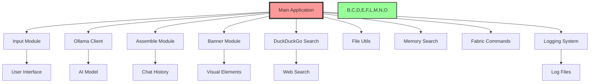

# 🏗️ Ollama_Agents: Comprehensive Architecture Guide 🤖

## 1. 🌐 Overview

Ollama_Agents is a modular and flexible framework for creating AI assistants. It leverages the Ollama API and is designed with extensibility in mind, allowing users to create and interact with multiple AI agents. The system now includes comprehensive logging for enhanced debugging and monitoring capabilities.

## 2. 🚀 Key Features

- 🎭 Multi-agent system: Interact with multiple AI personalities
- 🔀 Easy agent selection from the main menu
- 🎨 Colorful command-line interface
- 🧠 Enhanced memory management
- 🔍 Integrated DuckDuckGo search capabilities
- 🛠️ Modular design for easy customization
- 💬 Interactive CLI built with `prompt_toolkit`
- 🔐 Secure configuration options
- 🧪 Comprehensive testing suite
- 📜 Built-in chat history management
- 🔎 Memory search commands: `/ms` and `/msl`
- 🧵 Fabric pattern integration with `/fabric` command
- 📊 Comprehensive logging system for debugging and monitoring

## 3. 🏗️ System Architecture

Ollama_Agents is designed with modularity and flexibility in mind. Here's a high-level view of the components:

## 4. 🧱 Core Components

### 4.1 Main Application (`src/main.py`)
- Entry point of the application
- Manages the overall flow and agent selection
- Initializes logging system

### 4.2 Agents (`src/agents/`)
- `multi_agent.py`: Implements multi-agent functionality
- `one_agent.py`: Implements single agent functionality
- `simple_agent.py`: Basic agent implementation

### 4.3 Modules (`src/modules/`)
- `assemble.py`: Handles prompt assembly and history management
- `banner.py`: Manages CLI visual elements
- `basic_commands.py`: Implements core slash commands
- `chunk_history.py`: Manages document chunk history
- `ddg_search.py`: Integrates DuckDuckGo search functionality
- `document_commands.py`: Handles document-related operations
- `fabric_commands.py`: Integrates Fabric pattern functionality
- `file_utils.py`: Provides file handling utilities
- `input.py`: Manages user input processing
- `memory_commands.py`: Implements memory-related operations
- `memory_search.py`: Handles memory search functionality
- `ollama_client.py`: Manages communication with Ollama API
- `save_history.py`: Handles saving and loading of chat history
- `slash_commands.py`: Implements slash command processing
- `logging_setup.py`: Configures and initializes the logging system

## 5. 🔄 Data Flow

1. User input (`input.py`) → Main application (`main.py`)
2. Command processing (`slash_commands.py`) or agent interaction
3. If agent interaction:
   a. Prompt assembly (`assemble.py`)
   b. API communication (`ollama_client.py`)
   c. Response processing and display
4. Logging of operations and errors (`logging_setup.py`)

## 6. 🧠 Memory Management

- Short-term memory: Managed in `save_history.py`
- Long-term memory: Implemented through document chunks and embeddings
- Memory search: Implemented in `memory_search.py`

## 7. 🔍 Search Functionality

- Memory search: `/ms` and `/msl` commands
- Web search: Integrated through `ddg_search.py`

## 8. 🎨 User Interface

- CLI interface with rich formatting (`banner.py`)
- Interactive input handling (`input.py`)
- Customizable prompt style

## 9. 🔧 Extensibility

- New agents can be added to the `agents/` directory
- Additional modules can be integrated into the `modules/` directory
- Fabric patterns can be added through the `/fabric` command

## 10. 🔐 Configuration

- Central configuration managed in `config.py`
- Environment variables for sensitive information

## 11. 🧪 Testing

- Comprehensive test suite in `src/tests/`
- Covers core functionalities and modules
- Run tests using: `python -m unittest discover src/tests`

## 12. 📊 Logging System

### 12.1 Logging Setup (`logging_setup.py`)
- Centralizes logging configuration
- Initializes logger with appropriate log levels and handlers

### 12.2 Logging in Modules
- Each module uses the centralized logger
- Logs function entries, exits, important operations, and errors

### 12.3 Log Levels
- DEBUG: Detailed debugging information
- INFO: General information about program execution
- WARNING: Unexpected occurrences that aren't errors
- ERROR: Error events that might still allow the application to continue running
- CRITICAL: Very severe error events that will likely lead to application failure

### 12.4 Log Management
- Log rotation implemented to manage file sizes
- Regular log analysis for error patterns and performance issues

## 13. 🛠️ Customization Points

- 🎭 **Personality**: Tweak `config.py` to adjust your AI's persona
- 🧠 **AI Model**: Modify `ollama_client.py` to use different AI backends
- 🌈 **Appearance**: Customize `banner.py` for a unique look
- 🔍 **Search Engine**: Extend `ddg_search.py` to add more search providers
- 📊 **Logging**: Adjust log levels and formats in `logging_setup.py`

## 14. 🚀 Scaling Up

As your AI assistant grows, consider:

1. 📊 Database integration for long-term memory
2. 🌐 API endpoints for web/mobile interfaces
3. 🧠 Multiple AI models for specialized tasks
4. 🔒 Enhanced security features
5. 🔧 Performance optimizations for large-scale deployments
6. 📡 Distributed logging for multi-server setups

## 15. 🎉 Conclusion

Ollama_Agents is designed to be both powerful and playful. Each module plays a crucial role, and together they create an AI assistant that's greater than the sum of its parts. The comprehensive logging system enhances debugging and monitoring capabilities, making the system more robust and maintainable. This architecture allows for easy customization and extension, making it a versatile platform for building AI assistants.

Remember to keep your tests up-to-date as you add new features or modify existing ones. This will ensure the continued reliability and maintainability of your AI assistant.

Happy building! 🏗️✨
