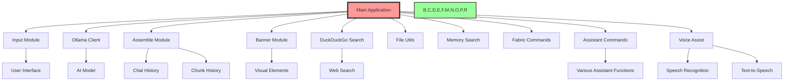

# 🏗️ Ollama_Agents: Comprehensive Architecture Guide 🤖

## 1. 🌐 Overview

Ollama_Agents is a modular and flexible framework for creating AI assistants. It leverages the Ollama API and is designed with extensibility in mind, allowing users to create and interact with multiple AI agents.

## 2. 🚀 Key Features

- 🎭 Multi-agent system: Interact with multiple AI personalities
- 🔀 Easy agent selection from the main menu
- 🎨 Colorful command-line interface
- 🧠 Enhanced memory management
- 🔍 Integrated DuckDuckGo search capabilities
- 🛠️ Modular design for easy customization
- 💬 Interactive CLI built with `prompt_toolkit`
- 🔐 Secure configuration options
- 🧪 Comprehensive testing suite
- 📜 Built-in chat history management
- 🔎 Memory search commands: `/ms` and `/msl`
- 🧵 Fabric pattern integration with `/fabric` command
- 🤖 Assistant command functionality
- 🎙️ Voice interaction capabilities

## 3. 🏗️ System Architecture

Ollama_Agents is designed with modularity and flexibility in mind. Here's a high-level view of the components:

## 4. 🧱 Core Components

### 4.1 Main Application (`src/main.py`)
- Entry point of the application
- Manages the overall flow and agent selection
- Initializes logging system

### 4.2 Agents (`src/agents/`)
- `multi_agent.py`: Implements multi-agent functionality
- `one_agent.py`: Implements single agent functionality
- `simple_agent.py`: Basic agent implementation
- `v_agent2.py`: Voice-enabled agent implementation

### 4.3 Modules (`src/modules/`)
- `assemble.py`: Handles prompt assembly and history management
- `banner.py`: Manages CLI visual elements
- `basic_commands.py`: Implements core slash commands
- `chunk_history.py`: Manages document chunk history
- `ddg_search.py`: Integrates DuckDuckGo search functionality
- `document_commands.py`: Handles document-related operations
- `fabric_commands.py`: Integrates Fabric pattern functionality
- `file_utils.py`: Provides file handling utilities
- `input.py`: Manages user input processing
- `memory_commands.py`: Implements memory-related operations
- `memory_search.py`: Handles memory search functionality
- `ollama_client.py`: Manages communication with Ollama API
- `save_history.py`: Handles saving and loading of chat history
- `slash_commands.py`: Implements slash command processing
- `logging_setup.py`: Configures and initializes the logging system
- `voice_assist.py`: Handles voice interaction capabilities

## 5. 🔄 Data Flow

1. User input (`input.py`) → Main application (`main.py`)
2. Command processing (`slash_commands.py`) or agent interaction
3. If agent interaction:
   a. Prompt assembly (`assemble.py`)
   b. API communication (`ollama_client.py`)
   c. Response processing and display
4. Logging of operations and errors (`logging_setup.py`)

## 6. 🧠 Memory Management

- Short-term memory: Managed in `save_history.py`
- Long-term memory: Implemented through document chunks and embeddings
- Memory search: Implemented in `memory_search.py`
- Flexible prompt assembly: `assemble.py` allows including or excluding chunk history

## 7. 🔍 Search Functionality

- Memory search: `/ms` and `/msl` commands
- Web search: Integrated through `ddg_search.py`

## 8. 🎨 User Interface

- CLI interface with rich formatting (`banner.py`)
- Interactive input handling (`input.py`)
- Customizable prompt style

## 9. 🎙️ Voice Interaction

- Speech recognition: Implemented in `voice_assist.py`
- Text-to-speech: Integrated for spoken responses
- Wake word detection: Allows hands-free activation

## 10. 🔧 Extensibility

- New agents can be added to the `agents/` directory
- Additional modules can be integrated into the `modules/` directory
- Fabric patterns can be added through the `/fabric` command
- Assistant commands can be extended in `slash_commands.py`

## 11. 🔐 Configuration

- Central configuration managed in `config.py`
- Environment variables for sensitive information

## 12. 🧪 Testing

- Comprehensive test suite in `src/tests/`
- Covers core functionalities and modules
- Run tests using: `python -m unittest discover src/tests`

## 13. 🤖 Assistant Command Functionality

The `/assistant` command provides a flexible way to add various helper functions to the Ollama_Agents system. This functionality is primarily implemented in the `slash_commands.py` file.

## 14. 🛠️ Customization Points

- 🎭 **Personality**: Tweak `config.py` to adjust your AI's persona
- 🧠 **AI Model**: Modify `ollama_client.py` to use different AI backends
- 🌈 **Appearance**: Customize `banner.py` for a unique look
- 🔍 **Search Engine**: Extend `ddg_search.py` to add more search providers
- 🤖 **Assistant Commands**: Add new commands in `slash_commands.py`
- 🎙️ **Voice Interaction**: Customize wake words and voice settings in `voice_assist.py`

## 15. 🚀 Scaling Up

As your AI assistant grows, consider:

1. 📊 Database integration for long-term memory
2. 🌐 API endpoints for web/mobile interfaces
3. 🧠 Multiple AI models for specialized tasks
4. 🔒 Enhanced security features
5. 🔧 Performance optimizations for large-scale deployments
6. 🌍 Multilingual support for voice and text interactions

## 16. 🎉 Conclusion

Ollama_Agents is designed to be both powerful and flexible. Each module plays a crucial role, and together they create an AI assistant that's greater than the sum of its parts. The modular architecture allows for easy customization and extension, making it adaptable to a wide range of use cases and requirements.

Remember to keep your tests up-to-date as you add new features or modify existing ones. This will ensure the continued reliability and maintainability of your AI assistant.

Happy building! 🏗️✨
