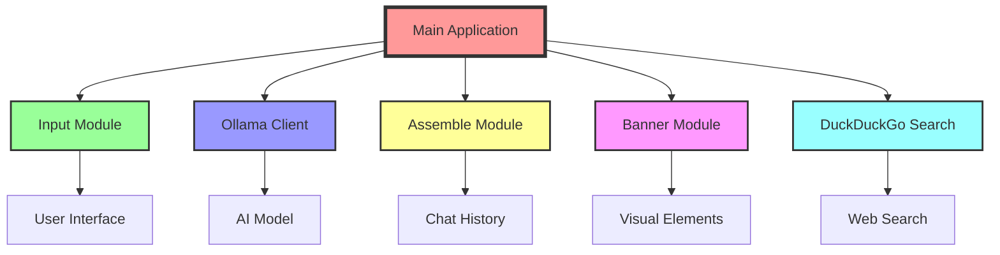
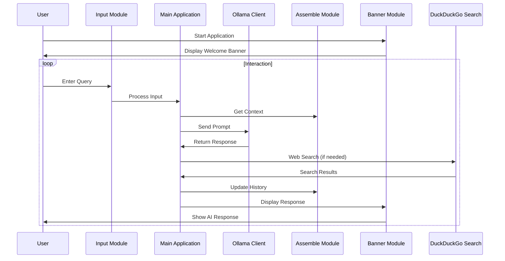

# 🏗️ AI_Functions Architecture Guide 🌈

Welcome to the colorful world of AI_Functions architecture! This guide will take you on a journey through the building blocks of our AI assistant. Let's dive in! 🏊‍♂️

## 🎭 Overview

AI_Functions is designed with modularity and flexibility in mind. It's like a LEGO set for AI - each piece has its purpose, and together they create something amazing!

## 🧱 Core Components

### 1. 🎛️ Main Application (`main.py`)
The conductor of our AI orchestra, coordinating all the modules.

### 2. 📥 Input Module (`input.py`)
Your AI's ears 👂, handling all user inputs with style.

### 3. 🤖 Ollama Client (`ollama_client.py`)
The brain 🧠 of the operation, interfacing with the Ollama AI model.

### 4. 🧩 Assemble Module (`assemble.py`)
The memory bank 💾, managing chat history and context.

### 5. 🎨 Banner Module (`banner.py`)
The face 😊 of your AI, creating beautiful visual elements.

### 6. 🔍 DuckDuckGo Search (`ddg_search.py`)
Your AI's gateway to the web 🌐, fetching real-time information.

## 🔄 Data Flow

1. User input ➡️ Input Module
2. Input Module ➡️ Main Application
3. Main Application ➡️ Assemble Module (for context)
4. Main Application ➡️ Ollama Client (for processing)
5. Ollama Client ➡️ Main Application
6. Main Application ➡️ User (via Banner Module)

## 🎨 UI/UX Flow

## 🛠️ Customization Points

- 🎭 **Personality**: Tweak `config.py` to adjust your AI's persona.
- 🧠 **AI Model**: Modify `ollama_client.py` to use different AI backends.
- 🌈 **Appearance**: Customize `banner.py` for a unique look.
- 🔍 **Search Engine**: Extend `ddg_search.py` to add more search providers.

## 🚀 Scaling Up

As your AI assistant grows, consider:

1. 📊 Database integration for long-term memory
2. 🌐 API endpoints for web/mobile interfaces
3. 🧠 Multiple AI models for specialized tasks
4. 🔒 Enhanced security features

## 🎉 Conclusion

AI_Functions is designed to be both powerful and playful. Each module plays a crucial role, and together they create an AI assistant that's greater than the sum of its parts. Happy building! 🏗️✨
