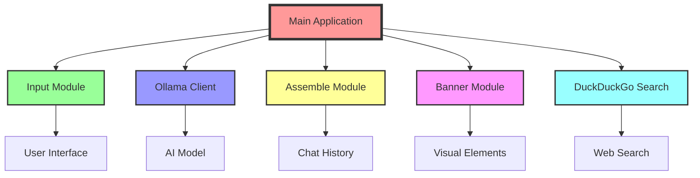
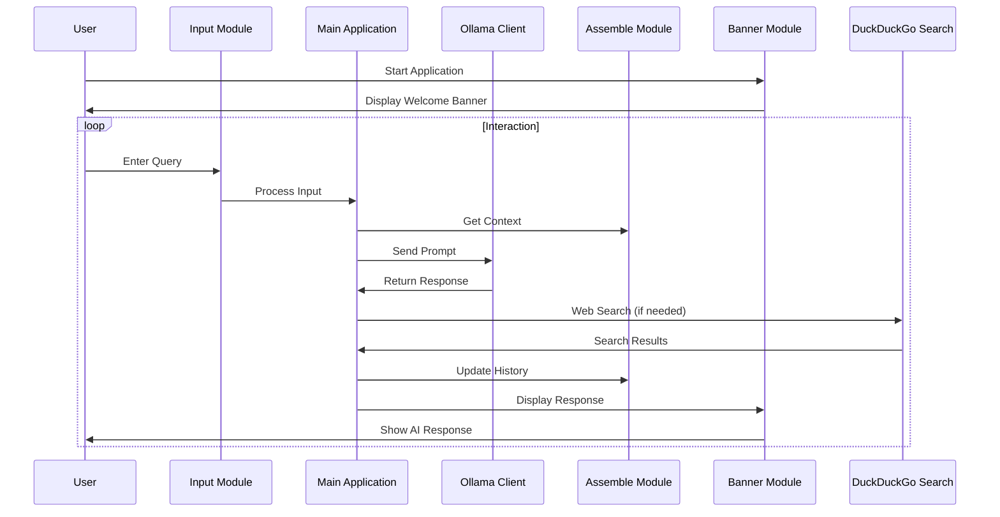

# 🌈 AI_Functions: Comprehensive Architecture Guide 🤖

Welcome to the magical world of AI_Functions! 🎉 This guide will take you on a journey through the architecture and components of our AI assistant builder. It's like having a LEGO set for AI - mix, match, and build your dream assistant! 🧱✨

## 🚀 Introduction and Key Features

AI_Functions is a modular and flexible framework for creating AI assistants. Here are some of its key features:

- 🎨 Colorful command-line interface
- 🧠 Enhanced memory management
- 🔍 Integrated DuckDuckGo search capabilities
- 🛠️ Modular design for easy customization
- 💬 Interactive CLI built with `prompt_toolkit`
- 🔐 Secure configuration options
- 🧪 Comprehensive testing suite
- 📜 Built-in chat history management

## 🏗️ System Architecture Overview

AI_Functions is designed with modularity and flexibility in mind. Here's a high-level view of how the components fit together:



## 🧱 Core Components

Let's dive deeper into each core component of AI_Functions:

### 1. 🎛️ Main Application (`main.py`)

The conductor of our AI orchestra, coordinating all the modules.

```python
def main():
    console = setup_console()
    print_welcome_banner(console, USER_NAME)
    load_chat_history()
    
    while True:
        user_input = get_user_input()
        if user_input is None:
            break
        elif user_input == 'CONTINUE':
            continue
        else:
            print_separator(console)
            current_prompt = f"You are {AGENT_NAME}, an AI assistant. {user_input}"
            full_prompt = assemble_prompt_with_history(current_prompt)
            response = process_prompt(full_prompt, DEFAULT_MODEL, USER_NAME)
            add_to_chat_history(user_input, response)
        print_separator(console)
    
    save_chat_history()
    console.print("[bold red]Goodbye![/bold red]")
```

This main loop orchestrates the entire application, handling user input, processing prompts, and managing the chat history.

### 2. 📥 Input Module (`input.py`)

Your AI's ears 👂, handling all user inputs with style.

```python
def get_user_input():
    prompt = f"{USER_NAME}> \n"
    history_file = os.path.expanduser("~/.input_history")
    completer_words = list(SLASH_COMMANDS.keys())
    completer = WordCompleter(completer_words, ignore_case=True)
    
    # ... (keyboard bindings and session setup)
    
    try:
        user_input = session.prompt()
        if user_input.startswith('/'):
            result = handle_slash_command(user_input)
            if result == 'EXIT':
                return None
            return 'CONTINUE'
        return user_input
    except (KeyboardInterrupt, EOFError):
        print("\nExiting program.")
        return None
```

This module uses `prompt_toolkit` to create a rich, interactive command-line interface. It supports command history, auto-suggestions, and custom key bindings for a smooth user experience.

### 3. 🤖 Ollama Client (`ollama_client.py`)

The brain 🧠 of the operation, interfacing with the Ollama AI model.

```python
class OllamaClient:
    def __init__(self, base_url="http://localhost:11434"):
        self.base_url = base_url
        self.console = Console()
        self.width = shutil.get_terminal_size().columns

    def process_prompt(self, prompt: str, model: str, username: str):
        url = f"{self.base_url}/api/generate"
        headers = {"Content-Type": "application/json"}
        data = {"model": model, "prompt": prompt}
        
        # ... (API call and response processing)
```

This client handles communication with the Ollama API, sending prompts and receiving responses. It uses streaming to display the AI's response in real-time, creating a more engaging interaction.

### 4. 🧩 Assemble Module (`assemble.py`)

The memory bank 💾, managing chat history and context.

```python
class ChatHistory:
    def __init__(self, max_length: int = 15):
        self.history: List[Tuple[str, str]] = []
        self.max_length = max_length
        self.file_path = Path.home() / ".ai_functions_chat_history.json"

    def add_entry(self, prompt: str, response: str):
        self.history.append((prompt, response))
        if len(self.history) > self.max_length:
            self.history.pop(0)

    def assemble_prompt_with_history(self, current_prompt: str) -> str:
        history_prompts = [f"User: {prompt}\nAssistant: {response}" for prompt, response in self.history]
        history_prompts_str = "\n\n".join(history_prompts)
        assembled_prompt = f"{history_prompts_str}\n\nUser: {current_prompt}\nAssistant:"
        return assembled_prompt
```

This module maintains the conversation history, allowing the AI to reference past interactions for more coherent and context-aware responses.

### 5. 🎨 Banner Module (`banner.py`)

The face 😃 of your AI, creating beautiful visual elements.

```python
def print_welcome_banner(console, username):
    banner = f"""
    [bold yellow] ██████  ███████ ███████  ██████  [/bold yellow]
    [bold red]██    ██    ███  ██      ██    ██[/bold red]
    [bold green]██    ██   ███   █████   ██    ██[/bold green]
    [bold blue]██    ██  ███    ██      ██    ██[/bold blue]
    [bold magenta]██    ██ ███     ██      ██    ██[/bold magenta]
    [bold cyan] ██████  ███████ ███████  ██████  [/bold cyan]

    [bold white]Your Personal AI :) [/bold white]

    [bold green]Welcome, {username}![/bold green]

    [bold red]Enter /help to get help. [/bold red]
    """
    console.print(Panel(Align.center(banner), border_style="bold white", expand=False))
```

This module creates a visually appealing welcome banner and separators, enhancing the overall user experience.

### 6. 🔍 DuckDuckGo Search (`ddg_search.py`)

Your AI's gateway to the web 🌐, fetching real-time information.

```python
class DDGSearch:
    def __init__(self):
        self.search = DuckDuckGoSearchRun()

    def run_search(self, query):
        try:
            results = self.search.run(query)
            if isinstance(results, str):
                results_list = results.split("\n")
            else:
                results_list = results
            return results_list
        except Exception as e:
            print(f"Error: {e}")
            return []
```

This module integrates DuckDuckGo search capabilities, allowing your AI to access up-to-date information from the web.

## 🧠 Memory Search (`memory_search.py`)

One of the most powerful features of AI_Functions is its ability to search through past conversations and use relevant information to inform its responses:

```python
def search_memories(query: str, top_k: int = 5, similarity_threshold: float = 0.0) -> List[Dict[str, Any]]:
    logging.info(f"Searching memories for query: {query}")
    memory_files = [f for f in data_dir.glob("*.json") if f.is_file()]
    embeddings = [get_embeddings(f.name, "nomic-embed-text") for f in memory_files]
    query_embedding = ollama.embeddings(model="nomic-embed-text", prompt=query)["embedding"]
    most_similar_files = find_most_similar(query_embedding, embeddings)

    relevant_memories = []
    for similarity, index in most_similar_files:
        if similarity < similarity_threshold:
            break
        if len(relevant_memories) >= top_k:
            break
        filename = memory_files[index].name
        memory_data = read_file(filename)

        relevant_memories.append({
            "prompt": memory_data.get("prompt", ""),
            "response": memory_data.get("response", ""),
            "similarity": similarity,
            "timestamp": memory_data.get("timestamp", "")
        })

    return relevant_memories
```

This function uses embeddings to find the most similar past conversations to the current query, giving your AI a super-powered memory.

## 🔄 Data Flow

1. User input ➡️ Input Module
2. Input Module ➡️ Main Application
3. Main Application ➡️ Assemble Module (for context)
4. Main Application ➡️ Ollama Client (for processing)
5. Ollama Client ➡️ Main Application
6. Main Application ➡️ User (via Banner Module)

## 🎨 UI/UX Flow



## 🛠️ Customization Points

- 🎭 **Personality**: Tweak `config.py` to adjust your AI's persona.
- 🧠 **AI Model**: Modify `ollama_client.py` to use different AI backends.
- 🌈 **Appearance**: Customize `banner.py` for a unique look.
- 🔍 **Search Engine**: Extend `ddg_search.py` to add more search providers.

## 🚀 Scaling Up

As your AI assistant grows, consider:

1. 📊 Database integration for long-term memory
2. 🌐 API endpoints for web/mobile interfaces
3. 🧠 Multiple AI models for specialized tasks
4. 🔒 Enhanced security features

## 🎉 Conclusion

AI_Functions is designed to be both powerful and playful. Each module plays a crucial role, and together they create an AI assistant that's greater than the sum of its parts. This architecture allows for easy customization and extension, making it a versatile platform for building AI assistants.

Happy building! 🏗️✨
